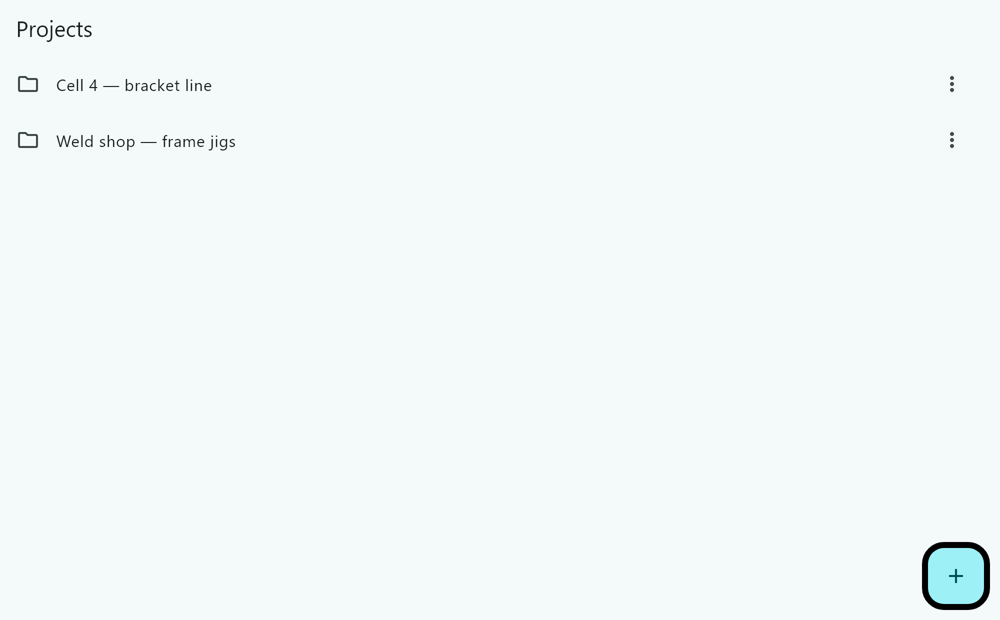
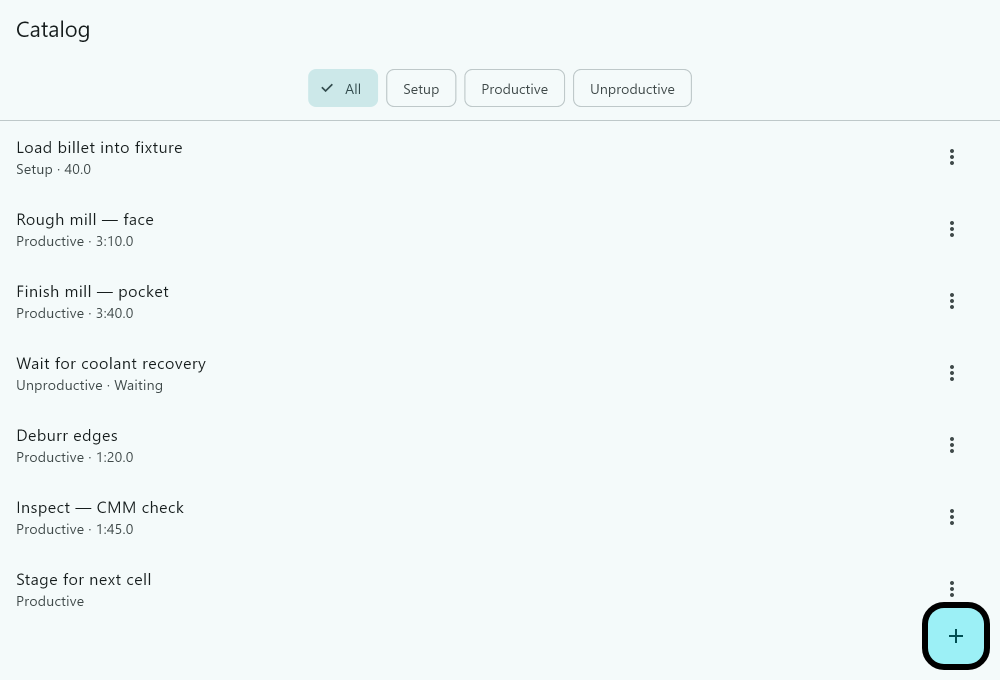
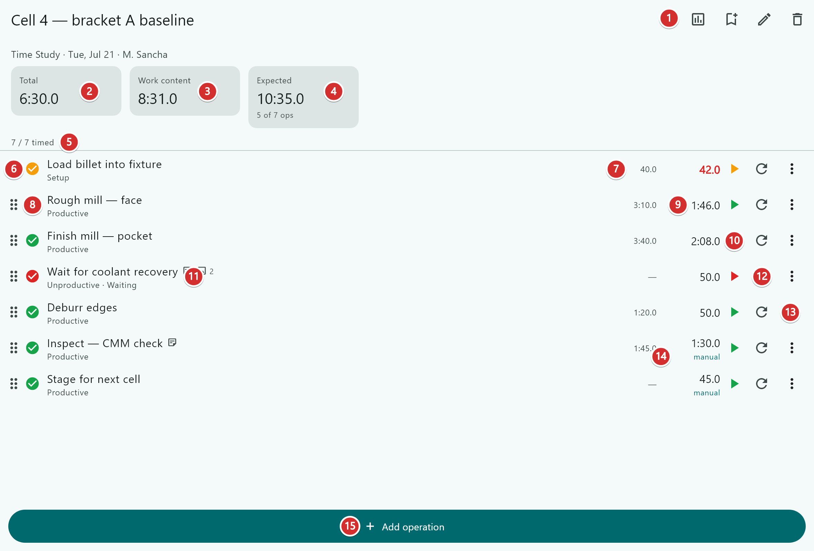
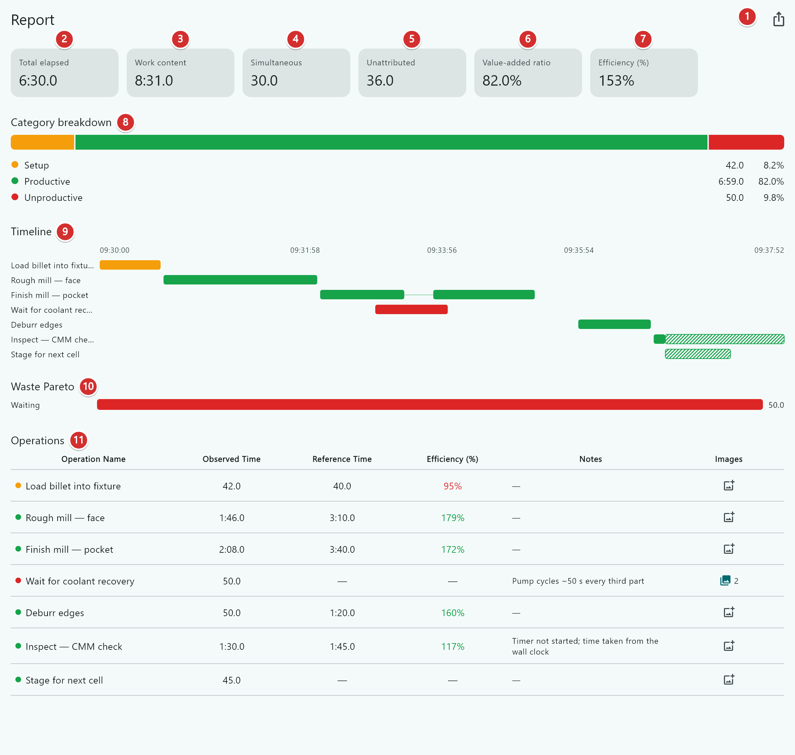
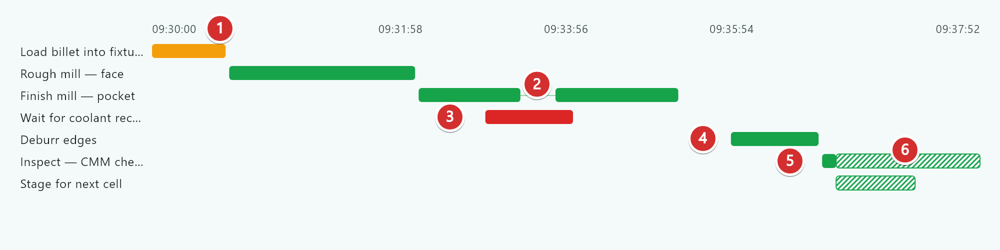
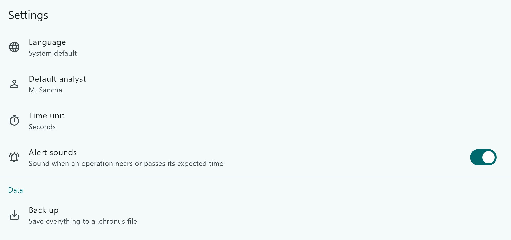

# Chronus — User Manual

**Time-study (cronoanálise) application for manufacturing engineers and technicians.**

Internal preview · Covers the Windows build · [Versão em português](MANUAL-pt.md)

---

## Contents

1. [What Chronus is for](#1-what-chronus-is-for)
2. [Installing and starting](#2-installing-and-starting)
3. [How the app is organised](#3-how-the-app-is-organised)
4. [Projects](#4-projects)
5. [The operation catalog](#5-the-operation-catalog)
6. [The study workspace](#6-the-study-workspace)
7. [Worked example: one bracket cycle](#7-worked-example-one-bracket-cycle)
8. [The report](#8-the-report)
9. [Reading the timeline](#9-reading-the-timeline)
10. [Why the numbers do not add up](#10-why-the-numbers-do-not-add-up)
11. [Sampling studies: taking several passes](#11-sampling-studies-taking-several-passes)
12. [The sampling report](#12-the-sampling-report)
13. [Comparing studies](#13-comparing-studies)
14. [Notes and photos](#14-notes-and-photos)
15. [Exporting](#15-exporting)
16. [Settings, backup and restore](#16-settings-backup-and-restore)
17. [Not built yet](#17-not-built-yet)
18. [Troubleshooting](#18-troubleshooting)

---

## 1. What Chronus is for

Chronus lets you stand at a machine, time a sequence of operations, classify each one as setup, value-added or waste, and produce a report you can defend in a meeting.

It is built for the way time studies actually run on a shop floor:

- **The clock is not always running.** Not every instant belongs to an operation. Dead time is only counted when you explicitly attribute it to something.
- **Operations overlap.** Two operators on one assembly, or a machine running while the operator waits. Chronus treats concurrency as normal, not as an error.
- **You correct as you go.** Operations get added mid-study, times get entered by hand when you forget to press start, and a measurement gets thrown away and redone.
- **One reading is not a measurement.** A repeating process gets timed several times and averaged, with the statistics to say whether you have measured enough yet, and the ability to throw out the run where the line was starved (§11).

Everything is stored on the computer you run it on. There is no login, no sync, and no server.

---

## 2. Installing and starting

1. Unzip the whole folder anywhere, e.g. `C:\Chronus`. There is no installer.
2. Run `chronus.exe`.
3. The first time, Windows may show **"Windows protected your PC"**. Click **More info → Run anyway**. This appears because the program is not yet code-signed.

Keep every file in the folder together — `chronus.exe` will not start on its own.

**Where your data lives.** Not in the program folder. It is kept in:

```
%APPDATA%\com.matheussancha\chronus
```

Paste that into the File Explorer address bar to open it. Because your data is stored outside the program folder, you can unzip a newer version over the old one without losing anything.

---

## 3. How the app is organised

```
Project
 └─ Study
     └─ Pass  (one for a Time Study, several for a Sampling Study)
         └─ Operations (timed individually)

Catalog  — reusable operation definitions, shared across all studies
Template — a reusable ordered sequence of operations
```

- A **Project** groups related studies — usually a cell, a line, or a product family.
- A **Study** is one investigation of a sequence. It comes in two types, chosen when you create it and changeable later:
  - **Time Study** — measured once. One pass, and opening the study takes you straight to it.
  - **Sampling Study** — the same sequence measured several times, then averaged, with statistics and a sample-size verdict. See §11.
- A **Pass** is one run through the sequence. Everything about timing works identically in either type, because a Time Study *is* a study with a single pass — there is no second way to run a stopwatch to learn.
- An **Operation** inside a study is a *copy* taken from the catalog at the moment you added it. Editing the catalog later will **not** change studies you have already run. That is deliberate: a report from March must not silently change because someone revised a standard in July.

### Classification

Every operation falls into one of three fixed categories. Reports roll up by these, so they cannot be edited:

| Category | Meaning |
|---|---|
| **Setup** | Preparation — fixturing, tool offsets, changeover |
| **Productive** | Value-added — the work the customer pays for |
| **Unproductive** | Waste — everything else |

Unproductive operations also carry a **subtype**, drawn from the seven wastes: Waiting, Motion, Transportation, Over-processing, Overproduction, Inventory, Defects. You can add your own subtypes, but always inside one of the three categories above, so roll-up reporting keeps working.

### Reference standard

Any operation can carry an optional **reference standard** — a benchmark time you already have. When present, Chronus reports:

**Efficiency = reference standard ÷ observed time**

At or above 100 % means you met or beat the benchmark.

---

## 4. Projects

The opening screen. Create a project with the **+** button, then open it to add studies.



Use the row menu to rename or delete. Deleting a project deletes its studies with it.

---

## 5. The operation catalog

The catalog is your reusable library of operation definitions. Build it once and each new study becomes a matter of picking from a list instead of retyping.

**It is not empty on a fresh install.** Chronus arrives with a short starter list taken from a real boring cycle, so a new PC can time something without an hour of typing first. Rename, edit or delete any of it — it is ordinary catalog content, not built-in. Two subtypes come with it, *Tool Setup/Change* and *Inspection*, because the operations that need them are not among the seven wastes.

The starter list carries **no reference standards**, on purpose: a benchmark nobody measured would flow into efficiency figures and pace alerts as though it meant something. Enter your real ones once, here, and every future study snapshots them.

If you empty the catalog deliberately, Chronus does not refill it on the next version — the offer is made once.



Each entry carries a **name**, a **category** (and subtype, if unproductive), and an optional **reference standard**. The chips at the top filter by category. The **+** button adds an entry; the **⋮** menu on each row edits or deletes it.

The second line of each row shows `Category · reference standard`. An entry with no reference standard simply shows the category.

---

## 6. The study workspace

This is the screen you drive during a study. It is a single list — you build the sequence, time it, and correct it all in the same place.



| | |
|---|---|
| **1** | **Report** — opens the analysis for this study |
| **2** | **Total** — wall-clock span, from the first start to the last stop |
| **3** | **Work content** — the operations added up; larger than Total whenever work overlapped |
| **4** | **Expected** — the planned time, adding up the reference times. The caption appears when some operations have no reference, because the plan is then understated |
| **5** | **Timed progress** — how many operations have a time yet |
| **6** | **Drag handle** — hold and drag to reorder the sequence |
| **7** | **Reference time** — the benchmark, if this operation has one |
| **8** | **State glyph** — colour is the category (amber setup, green productive, red unproductive); the mark shows whether it has been timed |
| **9** | **Observed time** — what was actually measured; amber near the reference time, red once past it |
| **10** | **Start** — begins timing this operation, from zero |
| **11** | **Note and photo indicators** — appear once a row has either |
| **12** | **Reset** — discards this operation's time and returns it to zero (asks first) |
| **13** | **Row menu** — edit, duplicate, delete, enter a time by hand, add a note or photo |
| **14** | **manual** — flags a time that was typed in rather than measured |
| **15** | **Add operation** — pick from the catalog, or create one on the spot |

**Total and Expected are not meant to be subtracted.** Total is a wall-clock span and Expected is a sum, so they only line up when nothing overlapped and there were no gaps. Compare **Work content** against **Expected** — those are both sums, so the comparison holds.

### Timing controls

Each operation has its **own independent timer**. There is no single master stopwatch.

- **▶ Start** — begins timing, from zero.
- **⏸ Pause** — stops the clock but keeps the elapsed time. Resuming opens a new segment. Chronus also offers to log the interruption as a separate unproductive operation, which is usually what you want.
- **⏹ Stop** — marks the operation complete.
- **↺ Reset** — throws the measurement away and returns the row to zero. It asks for confirmation.

Because each timer is independent, you can **run several at once**. Start the machine cycle, then start "operator waiting" alongside it — both run, and the overlap is measured and reported.

### Keyboard timing

On Windows you can run a whole study without touching the mouse, which matters when you are standing at a machine holding a clipboard.

| Key | What it does |
|---|---|
| **Space** | **The lap key.** Stops the running operation and starts the next one, with no gap between them. If nothing is running, it starts the first operation not yet timed |
| **↑ ↓** | Pick a row |
| **Enter** | Start or pause the picked row |
| **S** | Stop the picked row |
| **Esc** | Clear the picked row |

**Space is the one to learn.** A sequence measured back to back — where each operation begins the instant the last one ends — is one keypress per operation and produces no unattributed time at all. You do not have to pick rows first: with nothing running, Space finds the first untimed operation itself.

**With two or more operations running at once, Space deliberately does nothing.** Which one is "current" is genuinely ambiguous, and stopping the wrong operator's timer would ruin the measurement. Pick the row with **↑ ↓** and press **Enter** or **S**.

Press **F1** at any time for this list on screen — there is also a keyboard icon in the toolbar, because a shortcut nobody knows to ask for might as well not exist.

### Pace alerts

When an operation has a reference time, Chronus watches the clock against it.

- The observed time (**9**) turns **amber** as it comes within reach of the reference, and **red** once it passes. The colour stays afterwards, so you can scan a finished study for overruns at a glance.
- A **rising** two-note sound plays as it nears the reference; a **falling** one plays when it passes.

The warning comes one tenth of the reference time before the end, and never earlier than 30 seconds before it. A 40-second operation is flagged at 36 seconds; a two-hour one at 1:59:30. It is a *get ready to press stop* cue, not a schedule warning.

Each sound plays **once**. Pausing and resuming does not repeat it, and neither does leaving the screen and coming back — only **↺ Reset**, which throws the time away anyway, re-arms an operation. Operations without a reference time are never coloured and never make a sound.

Turn the sounds off under **Settings → Alert sounds**. The colours stay either way, so a muted app still shows overruns.

### Timing more than one operation at a time

This is the case Chronus exists for. Say the machine runs for 90 seconds and the operator stands idle for 50 of them:

1. Press **▶** on *Finish mill*.
2. Press **▶** on *Wait for coolant recovery* as well. Both are now running.
3. Press **⏹** on the wait when the operator resumes.
4. Press **⏹** on the mill when the cycle ends.

Both times are recorded in full, and the 50 seconds they share is reported as **Simultaneous**.

### Entering a time by hand

If you forgot to press start, or you are transcribing a paper study, use **Enter actual time** from the row menu (**13**).

A hand-entered time **shadows** the measurement rather than erasing it — any segments you did record are kept underneath. Clear the manual value and the measured time comes back. Rows carrying one are tagged **manual** (**14**), and the report draws them hatched so nobody mistakes them for measured evidence.

---

## 7. Worked example: one bracket cycle

Every screenshot in this manual comes from the same study, so you can follow it end to end. It is a bracket machining cycle on a Haas VF-2, and it is deliberately messy — it contains every awkward case you will hit in real work.

**Setting up**

1. From **Projects**, create *Cell 4 — bracket line*, and open it.
2. Add a study, name it *Cell 4 — bracket A baseline*. The analyst is filled in from Settings.
3. Fill in the header: part, machine, operator, shift, work order. All optional, all printed on the report.
4. Press **Add operation** (**15**) seven times, picking each from the catalog.

**Running it**

5. **▶** *Load billet into fixture*, **⏹** at 42.0 s. The reference standard is 40.0 s — slightly over.
6. **▶** *Rough mill — face*, **⏹** at 1:46.0.
7. **▶** *Finish mill — pocket*. Mid-cut the operator stops to clear chips: **⏸**, then **▶** again 20 s later. The two segments total 2:08.0.
8. While the mill is still running, **▶** *Wait for coolant recovery* — the operator is idle waiting for the pump. **⏹** at 50.0 s. **This ran at the same time as the finish mill.**
9. Nothing happens for half a minute — nobody presses anything. That gap becomes **unattributed** time.
10. **▶** *Deburr edges*, **⏹** at 50.0 s.
11. *Inspect — CMM check*: the timer was never started. Row menu → **Enter actual time** → `1:30`. It gets tagged **manual**.
12. *Stage for next cell*: never timed at all, entered as 45.0 s by hand.

**Reading it**

13. Press the **Report** button (**1**). Everything in §8 follows from these twelve steps.

---

## 8. The report

Read-only. Timing happens in the workspace; this screen only presents it.



| | |
|---|---|
| **1** | **Export** — PDF or XLSX (see §15) |
| **2** | **Total elapsed** — wall-clock span, first start to last stop. Here **6:30.0** |
| **3** | **Work content** — the sum of every operation's time. Here **8:31.0** |
| **4** | **Simultaneous** — time with two or more operations running at once. Here **30.0 s** |
| **5** | **Unattributed** — time inside the span that no operation covers. Here **36.0 s** |
| **6** | **Value-added ratio** — productive share of work content. Here **82.0 %** |
| **7** | **Efficiency** — Σ reference ÷ Σ observed, over operations that have both. Here **153 %** |
| **8** | **Category breakdown** — setup / productive / unproductive, by work content |
| **9** | **Timeline** — the wall-clock Gantt (see §9) |
| **10** | **Waste Pareto** — waste time by subtype, ranked worst first |
| **11** | **Operations** — observed, reference, efficiency, notes and photo count per row |

In the operations table, efficiency is coloured: green at or above 100 %, red below. *Load billet* shows **95 %** in red — 42.0 s observed against a 40.0 s standard.

---

## 9. Reading the timeline

The timeline is a **real wall-clock Gantt**. The horizontal axis is the actual time of day, not a sequence. Rows stay in planned order so they line up with the operations table.



| | |
|---|---|
| **1** | **Wall-clock axis** — real clock readings. A study with no live timing at all keeps a relative `0:00…` axis instead |
| **2** | **A gap inside a row** — the operation was paused and resumed |
| **3** | **Two rows overlapping in time** — concurrency. The coolant wait ran during the finish mill |
| **4** | **Whitespace between bars** — unattributed dead time, covered by no operation |
| **5** | **Solid fill** — backed by a real measured segment |
| **6** | **Hatched fill** — reported but *not* measured, i.e. a hand-entered time |

The hatching matters. A bar's total width always equals the operation's **reported** time, so the chart can never disagree with the table. But an override longer than what was measured extends past the evidence, and that extension is drawn hatched. When you see an overlap involving hatching, read it as *unverified*, not observed.

Hatching is diagonal lines rather than a lighter shade on purpose — a lighter shade is indistinguishable from solid once the report is printed in black and white.

---

## 10. Why the numbers do not add up

This is the single most common question, and the numbers are not wrong.

**Total elapsed (6:30.0) is smaller than work content (8:31.0).**

Work content is the plain sum of every operation's time. When two operations run at once, that sum counts the shared stretch twice. Elapsed is the real span on the clock, which counts it once. So:

> Work content **counts overlap twice**. Total elapsed **never does**.

Never add operation times together to get "how long the job took" — that is what **Total elapsed** is for.

The two totals reconcile like this:

```
Total elapsed = covered time + unattributed time
      6:30.0  =     5:54.0   +      36.0 s
```

- **Simultaneous (30.0 s)** is swept from the actual recorded intervals, not calculated as `work − elapsed`. That shortcut only works when a study has no gaps, and goes negative as soon as gaps exceed overlap.
- **Unattributed (36.0 s)** is time inside the span that no operation claims. A large value usually means somebody forgot to press start.

**Efficiency of 153 % with an operation at 95 %.** Aggregate efficiency is `Σ reference ÷ Σ observed` across every operation that has both figures — not an average of the percentages. A few operations well under their standard dominate the total.

---

## 11. Sampling studies: taking several passes

One reading is not a measurement of a repeating process. Time the same cycle five times and you get five different numbers — the question is what the real time is, and how sure you are. A **Sampling Study** is the same sequence measured several times, averaged, with the statistics to say whether you have measured enough.

Set **Study type → Sampling Study** when you create the study, or change it later from the edit screen. Everything else works exactly as in §6: there is no second way to run a stopwatch to learn.

### The pass list

Opening a Sampling Study shows its **Passes**, not the workspace.

Each row is one run through the sequence: its number, when it was timed, and how many operations it covered (*3 of 7 timed*, or *Nothing timed yet*). **New pass** adds one. Tap any pass to open the workspace from §6 on it — unchanged, including Space and the pace alerts.

A Time Study is the same thing with a single pass, so it skips this screen and opens the workspace directly.

**Pass numbers are never reused and never renumbered.** *Pass 4* in an exported file, or written on a sheet of paper, means the same pass forever. Delete a pass and the list shows the gap rather than quietly closing it.

### Editing the sequence part-way through

You can add, remove and reorder operations at any point, including after passes have been timed — a run across a whole shift will certainly hit an interruption that needs recording, and refusing to record it would push its time into *unattributed*, which is exactly where attributed dead time should not go.

- An operation added at pass 4 simply has fewer readings than its neighbours. The report shows **n per operation**, so partial coverage is visible rather than something you have to infer.
- **Deleting** an operation warns you how many passes lose measurements, because it removes that row's evidence from every pass, not just the one you are in.
- An operation marked **unplanned** is shown with its statistics but left out of the study-level verdict. An interruption timed once would otherwise pin the study at "not adequate" forever, for a row that is not part of the standard sequence.

### Throwing out a bad reading, or a bad pass

Cronoanálise discards anomalous readings before averaging. Chronus lets you do that explicitly, and the rules are the same at both levels: **exclusion is reversible, attributed, and never automatic.**

- **One reading** — from the readings matrix in the sampling report (§12), **Exclude this reading**.
- **A whole pass** — from its row menu in the pass list, **Exclude from statistics**. Use this when the run itself was rubbish: the line was starved, the operator was training. It carries an optional reason, and the row is badged **Excluded**.

> **Excluding is not deleting.** The measurement stays in the database, stays in that pass's own report — the pass really did take that long — and stays in the **Segments** sheet of an export. It is only left out of the mean, the deviation, the CV and the sample-size verdict. **Put back in the statistics** undoes it at any time.

The report always states how many readings were excluded, so a mean can never quietly rest on a smaller sample than it appears to.

**Chronus never excludes anything on its own.** It has no automatic outlier rule, because at these sample sizes the textbook one does not work — a single outlier inflates the standard deviation enough to bring itself back inside the bound, so with five passes it usually excludes nothing, and when it does fire it changes numbers you never agreed to. Only you know whether a long cycle was legitimate.

**Deleting a pass** is refused while it holds measurements — the app tells you to exclude it instead, which keeps the evidence. An empty pass deletes without argument, and a study always keeps at least one.

**Report for this pass**, from the row menu, opens the full §8 report for that pass alone: summary tiles, timeline, the lot. A single pass *is* a time study. This is how you explain an outlier — what ran alongside it, where it paused — **before** deciding to exclude it, rather than after.

---

## 12. The sampling report

The toolbar report button on a Sampling Study opens this instead of §8. It answers two questions: *what is the time*, and *have I measured enough*.

It is aggregate only. There is deliberately **no timeline, no total elapsed, no simultaneous and no unattributed** here — those describe one run of the clock, and averaging them across passes produces figures that do not describe anything. They live in each pass's own report (§11).

### The verdict

At the top, in words:

| What you see | What it means |
|---|---|
| **Adequate — 6 needed** | You have taken enough passes for the precision you asked for |
| **Not adequate — 4 more passes** | You are short, by that many |
| **Not enough passes to judge yet** | Some operation has fewer than two readings, so there is no spread to extrapolate from |
| **Nothing timed yet** | No operation has a reading in any pass |

Beside it: your criteria (*95 % confidence · ±5 %*), how many passes you have taken, and — when you are short — **Governed by: _operation_**.

**That last line is the point.** Passes are taken through the whole sequence; you cannot add passes for one operation alone. So the operation needing the most passes decides the answer for the study, and naming it turns the verdict into an instruction — *four more passes, and Inspect is what needs them* — instead of a grade.

**Never timed: _operations_** is listed separately, because incomplete is not the same as inadequate. An operation nobody has timed yet is missing coverage, not failing a precision test.

Set the criteria per study on the edit screen: **Confidence level** and **Precision (± % of the mean)**. They default to the usual 95 % and ±5 %.

### Per-operation statistics

One row per operation:

| Column | Meaning |
|---|---|
| **n** | How many readings are in the average |
| **Mean** | The representative time |
| **Range** | Largest reading minus smallest |
| **Std dev** | Spread of the readings |
| **CV** | Standard deviation as a percentage of the mean — comparable between a 5-second and a 5-minute operation |
| **Needed** | Passes required for your criteria |

A high **CV** is the number to watch. It says the operation is inconsistent, which is usually more interesting than its mean — an inconsistent operation is one you can improve by making it repeatable, before trying to make it faster.

Above the table, **Work content (mean pass)** and the aggregate **Efficiency** describe the average pass as a whole.

### The readings matrix

Operations down, passes across, so you can see the actual numbers behind every mean and spot the odd one out by eye.

- An excluded reading is struck through and stays visible — it is evidence, not a mistake.
- A reading that was **entered by hand** rather than measured is marked, and the count of them is stated with the statistics. Typed times do count toward the mean: a study transcribed from paper would otherwise have no statistics at all. But a standard deviation over typed numbers means very little, and you can only know that if you are told.
- A blank means that pass never timed that operation. Not a zero — a zero would be a measurement.

Tap a reading to exclude it or put it back.

---

## 13. Comparing studies

Did the change work? Open a project and press **Compare studies** in the toolbar, tick two or more studies, and Chronus lines them up.

Studies are matched **by the catalog operations they share**. An operation you created on the spot inside one study has nothing to match against, which is why building the sequence from the catalog (§5) is what makes a comparison possible later.

**Time Studies and Sampling Studies mix freely.** A Time Study contributes its single reading; a Sampling Study contributes its mean.

### What you get

A **side-by-side table** — one column per study, oldest to newest, plus a **Change** column — and a **trend** chart per operation over time.

Every figure carries the things that decide whether it can be trusted:

| Marker | Meaning |
|---|---|
| **n = 6** | How many readings stand behind the figure |
| **○** | A single reading, not a mean |
| **x4 in the sequence** | The figure is the total of four occurrences of that operation in one pass |
| *blank* | That study never timed this operation |

**Why n is on every cell.** "Weld seam improved 6 % since March" reads as a finding until you notice March was one press of a stopwatch. A mean over six passes and a single reading are otherwise the same number in the same column.

**Why occurrences are summed, not averaged.** A boring cycle that inspects after every tool pass has four inspections in one pass. The cell shows the *inspection content of a pass* — all four added up — because that is the figure that changes when the process improves. Averaging them instead would report **no change** when a process went from inspecting four times to twice, which is precisely the improvement you opened this screen to see. The count is shown so a repeated operation is never mistaken for a slow one.

The operation's name and reference standard come from the **newest** study in the comparison: names are snapshotted per study and legitimately differ, and "are we meeting it" means the standard in force now.

### What was left out

Below the table, a stated count: **_n_ operations not compared — no catalog link**, and their names.

This is deliberately loud. A comparison that quietly omitted a third of the work content would be worse than one that admits it — and this is the artifact most likely to be read by somebody who ran neither study. Only operations that were actually timed are listed; one that nobody timed contributes nothing either way.

If nothing can be matched at all, Chronus says so rather than showing an empty table.

---

## 14. Notes and photos

Both attach to an individual operation, from the row menu (**13**).

- **Notes** — free text. They print in the Notes column of the report and the PDF.
- **Photos** — take one with the camera, or pick an existing file. They are embedded in the PDF export.

Once a row carries either, small indicators appear next to its name (**11**), with a count for photos.

On a phone or tablet, **Add photo** offers **Take photo** or **Choose from library**. On Windows it opens a file dialog — desktop has no camera.

Photos are downscaled on import. They are documentation, not archival captures, and full-resolution phone images would make backups too large to email.

---

## 15. Exporting

From any report screen. Two formats, two jobs — the PDF is what you hand to someone, the XLSX is what you work on.

Durations are written as decimal seconds so they behave as numbers in a spreadsheet. Sheet names stay in English regardless of app language, so formulas built on top of an export survive a language change. On Windows, export opens a save dialog.

### A time study, or a single pass

**PDF.** Study header, summary tiles, category breakdown, the timeline, the waste Pareto, the operations table, and any attached photos. One fixed layout.

**XLSX:**

| Sheet | Contents |
|---|---|
| Summary | The header fields and the totals |
| Operations | One row per operation: observed, reference, efficiency |
| Segments | **One row per measured interval** — the raw evidence |

The **Segments** sheet is the one to reach for when somebody challenges a result. It contains exactly the intervals the timeline draws and that Simultaneous is calculated from, so the overlap can be recomputed independently and cross-checked against machine logs. Hand-entered time is deliberately absent from it — a typed number is not a measurement.

### A sampling study

**One workbook for the whole study**, every pass included, one row per fact:

| Sheet | Contents |
|---|---|
| Summary | Header, your criteria, the verdict, the governing operation |
| Statistics | One row per operation — n, mean, min, max, range, std dev, CV, passes needed |
| Observations | One row per **pass × operation** — the reading, and whether it was excluded or entered by hand |
| Segments | As above, with a leading **Pass** column |

**Observations is what makes the mean checkable.** Filter it to `Excluded = 0`, average the seconds column, and you will land on the number the app reports. The flags are written as `1` and `0`, not as words, so the column filters and sums. There is a test in Chronus that performs exactly that check, because the guarantee would otherwise rot silently.

Two details worth knowing:

- A pass that never timed an operation contributes **no row at all**. A zero would be a measurement and a blank would be a reading; absence is the only honest encoding of "not timed here".
- An **excluded pass still contributes its Segments rows**. Exclusion is a statement about the average, not about whether the clock ran.

The **Statistics** sheet also carries the `t` value and degrees of freedom, so you can put them back into the sample-size formula by hand and land on the same answer.

The **PDF** leads with the aggregate sections and follows with **Passes in detail** — an appendix carrying each pass's summary and timeline. One file to hand over, rather than eleven for a ten-pass study.

### A comparison

From the comparison screen (§13). The formats split by job here too:

- **PDF** — the side-by-side matrix, in landscape, with `n` and the occurrence count on every figure.
- **XLSX** — flat, one row per operation × study, with an **Occurrences** column. The operations left out get their own **Unmatched** sheet rather than a note at the bottom, because a note at the bottom of a sheet is the first thing lost to a filter.

The file is named for the **project** and dated today, not after any study in it — it is a reading of several studies taken at a moment, and dating it by one of them would misattribute it.

---

## 16. Settings, backup and restore



- **Language** — Portuguese, English or Spanish. *System default* follows Windows.
- **Default analyst** — pre-fills the Analyst field on new studies.
- **Time unit** — seconds, or decimal minutes.
- **Alert sounds** — the pace cues described in §6. On by default; the amber/red colours stay even with sound off.

### Two safety nets, for two different failures

They are not alternatives — they protect against different things, and only one of them needs you to remember anything.

| | **Back up** (`.chronus`) | **Automatic copies** |
|---|---|---|
| Protects against | losing the machine | a bug or a bad upgrade in Chronus |
| Contains | studies **and photos** | studies only |
| Happens | when you press the button | on its own, once a day at launch |
| Leaves this PC | yes — that is the point | no |

### Backing up

**Back up** writes a single `.chronus` file containing your entire database and every photo. Put it somewhere that is not this PC — a network share, a USB stick, a OneDrive folder.

There is no sync. If the PC dies and you have no `.chronus` file anywhere else, the studies are gone — the automatic copies live on the same disk and will not save you from that. On a shared shop-floor machine, back up at the end of every study.

### Automatic copies

Chronus copies its database **once a day, on its own**, and keeps the last three. No prompt, no nagging, and it can never delay or fail a launch. They are listed under **Settings → Data** with the date each was taken, and restoring one asks for confirmation the same way a backup restore does.

**Photos are not included, and are never touched by restoring one.** Photos are written once and never modified, so they are not at risk from the failure this guards against — and keeping three copies of the photo library would cost enormously more disk to protect something that was never in danger. What that means in practice: roll back to yesterday and a photo you added today becomes an unused file on disk, while one you deleted today shows as a broken thumbnail. Both are better than losing the library.

### Version and diagnostics

Also under **Settings → Data**:

- **Version** — the build label, e.g. `2026-07-29`. Quote this when you report anything; it is what identifies your copy.
- **Save diagnostics** — writes a text file with the app's recent history: launches, whether the database was upgraded, whether the daily copy was made, and any errors. Send it along with a problem report and most questions can be answered without a guessing game.
- **Send feedback** — note what got in the way, in your own words. It is stored locally and travels with the diagnostics file; nothing is transmitted anywhere on its own.
- **Open data folder** — opens `%APPDATA%\com.matheussancha\chronus`, where the database, the photos and the automatic copies live.

### Restoring

**Restore** reads a `.chronus` file back in.

> **Restore replaces everything.** It is not a merge. Every project, study and photo currently in the app is discarded and replaced by the file's contents. Back up first if the current data matters.

The file is validated before anything is touched, so a corrupt or rejected file leaves the app exactly as it was. A backup from a newer version of Chronus is refused rather than half-read; an older one is upgraded automatically on import.

The same file is how you move data between machines: back up on one PC, copy the file across, restore on the other.

---

## 17. Not built yet

This is an internal preview. These are designed but not yet available:

- **Video attachments** — photos work; video does not
- **Cross-project comparison** — comparing studies works within one project (§13), not across projects
- **Confidence bands on the comparison trend** — the trend shows the means; it does not yet draw the interval around them, so "did this actually get faster" is still eyeballed rather than answered
- **iPhone / iPad version**

Times, categories, passes, statistics, reports, comparisons and exports are complete and safe to rely on.

---

## 18. Troubleshooting

**"Windows protected your PC" when starting.** Expected — the program is not code-signed. **More info → Run anyway**.

**A missing-DLL error on startup.** Install the [Microsoft Visual C++ Redistributable (x64)](https://aka.ms/vs/17/release/vc_redist.x64.exe), then try again.

**The app starts but shows no projects.** Data is per Windows user account. If someone else set up the studies under their login, you will not see them — restore from their `.chronus` backup.

**Work content is larger than total elapsed.** Correct behaviour. See §10.

**An operation shows a time but the timeline draws it hatched.** The time was typed in, not measured. See §9.

**Unattributed time is large.** Somebody forgot to press start, or the study ran with long stretches that were never attributed to any operation. Check the timeline for wide gaps.

**I reset an operation by accident.** The measurement is gone — reset discards it. Restore from your most recent backup or from yesterday's automatic copy (§16), or re-enter the time by hand.

**Space does nothing.** Either two or more operations are running at once — pick a row and press **Enter** or **S** instead (§6) — or every operation already has a time.

**The sampling report says "Not enough passes to judge yet".** Some operation has only one reading, and one reading has no spread to extrapolate from. Take another pass.

**The sampling report has no timeline.** Correct — a timeline describes one run of the clock, so it lives in each pass's own report. Open a pass from the list and use **Report for this pass** (§11).

**A study is missing from the comparison, or an operation is.** Studies are matched by the catalog operations they share (§13). An operation created on the spot inside one study has nothing to match against — it will be listed under *not compared*. Build sequences from the catalog to keep comparisons possible.

**The comparison shows a much larger time than I measured.** Check for **x_n_ in the sequence** under the figure: it is the total of that many occurrences of the operation in one pass, not one of them.

**My studies vanished after an upgrade.** Settings → Data → **Automatic copies**, and restore yesterday's. Then **Save diagnostics** and send it on — that is the failure the copies exist for, and the log says whether the database was upgraded at launch.
