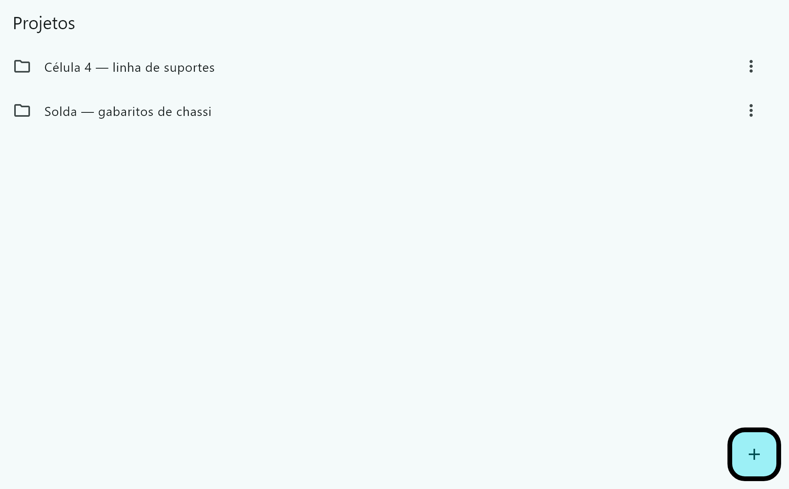
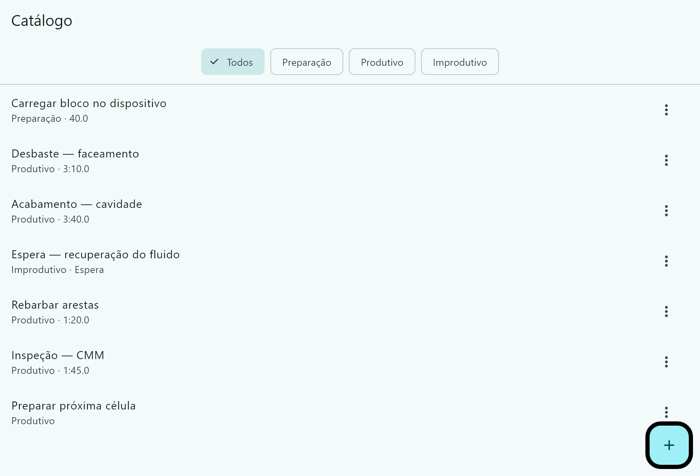
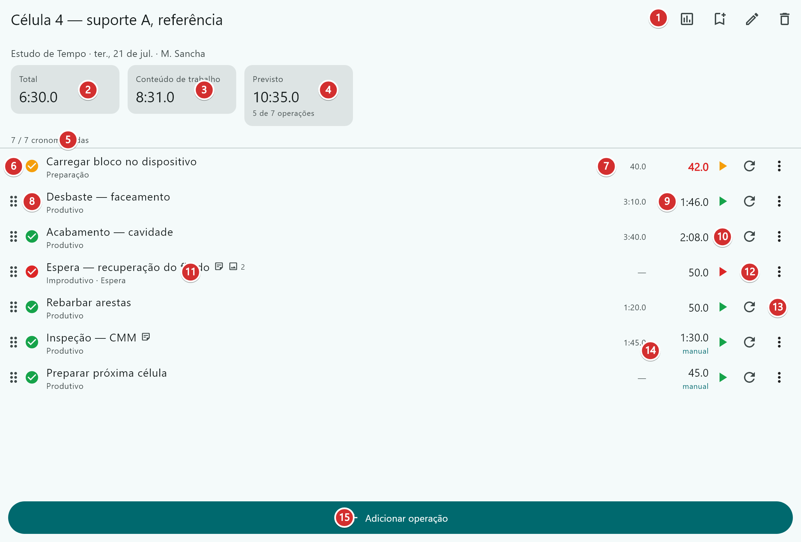
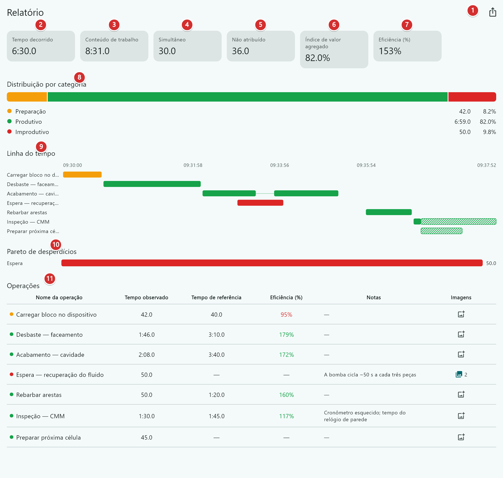
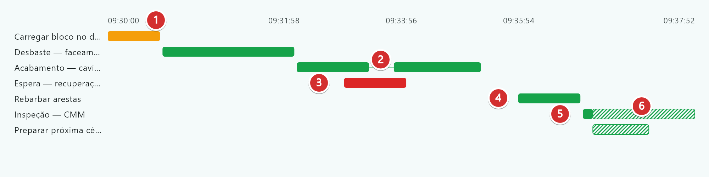
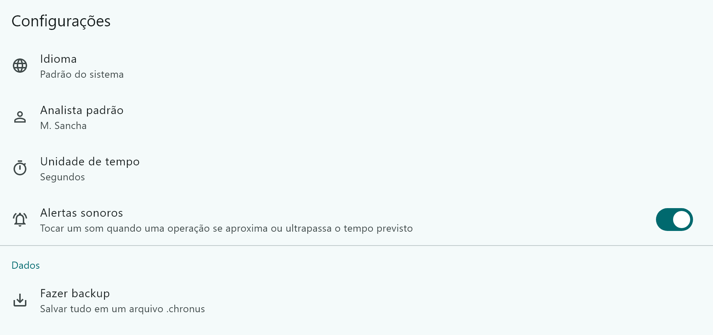

# Chronus — Manual do Usuário

**Aplicativo de cronoanálise para engenheiros e técnicos de manufatura.**

Prévia interna · Referente à versão Windows · [English version](MANUAL-en.md)

---

## Índice

1. [Para que serve o Chronus](#1-para-que-serve-o-chronus)
2. [Instalação e primeiro uso](#2-instalação-e-primeiro-uso)
3. [Como o aplicativo é organizado](#3-como-o-aplicativo-é-organizado)
4. [Projetos](#4-projetos)
5. [O catálogo de operações](#5-o-catálogo-de-operações)
6. [A tela do estudo](#6-a-tela-do-estudo)
7. [Exemplo prático: um ciclo de suporte](#7-exemplo-prático-um-ciclo-de-suporte)
8. [O relatório](#8-o-relatório)
9. [Como ler a linha do tempo](#9-como-ler-a-linha-do-tempo)
10. [Por que os números não fecham](#10-por-que-os-números-não-fecham)
11. [Notas e fotos](#11-notas-e-fotos)
12. [Exportação](#12-exportação)
13. [Configurações, backup e restauração](#13-configurações-backup-e-restauração)
14. [Ainda não disponível](#14-ainda-não-disponível)
15. [Solução de problemas](#15-solução-de-problemas)

---

## 1. Para que serve o Chronus

O Chronus permite que você fique ao lado da máquina, cronometre uma sequência de operações, classifique cada uma como preparação, agregação de valor ou desperdício, e gere um relatório que se sustenta numa reunião.

Ele foi feito para a forma como a cronoanálise realmente acontece no chão de fábrica:

- **O cronômetro nem sempre está rodando.** Nem todo instante pertence a uma operação. Tempo morto só é contabilizado quando você o atribui explicitamente a alguma coisa.
- **Operações se sobrepõem.** Dois operadores numa montagem, ou a máquina rodando enquanto o operador espera. Para o Chronus, simultaneidade é normal, não é erro.
- **Você corrige durante o processo.** Operações são acrescentadas no meio do estudo, tempos são digitados quando você esquece de apertar o start, e uma medição é descartada e refeita.

Tudo fica salvo no computador em que o programa roda. Não há login, não há sincronização e não há servidor.

---

## 2. Instalação e primeiro uso

1. Descompacte a pasta inteira em qualquer lugar, por exemplo `C:\Chronus`. Não há instalador.
2. Execute o `chronus.exe`.
3. Na primeira vez, o Windows pode mostrar **"O Windows protegeu o seu PC"**. Clique em **Mais informações → Executar assim mesmo**. Isso acontece porque o programa ainda não tem assinatura digital.

Mantenha todos os arquivos da pasta juntos — o `chronus.exe` não funciona sozinho.

**Onde ficam os seus dados.** Não é na pasta do programa. Eles ficam em:

```
%APPDATA%\com.matheussancha\chronus
```

Cole esse caminho na barra de endereço do Explorador de Arquivos para abrir. Como os dados ficam fora da pasta do programa, você pode descompactar uma versão nova por cima da antiga sem perder nada.

---

## 3. Como o aplicativo é organizado

```
Projeto
 └─ Estudo
     └─ Operações (cronometradas individualmente)

Catálogo — definições de operação reutilizáveis, compartilhadas entre estudos
Modelo   — uma sequência de operações reutilizável
```

- Um **Projeto** agrupa estudos relacionados — normalmente uma célula, uma linha ou uma família de produtos.
- Um **Estudo** é uma passagem cronometrada por uma sequência de operações.
- Uma **Operação** dentro de um estudo é uma *cópia* tirada do catálogo no momento em que você a adicionou. Editar o catálogo depois **não** altera estudos já realizados. Isso é proposital: um relatório de março não pode mudar sozinho porque alguém revisou um padrão em julho.

### Classificação

Toda operação pertence a uma de três categorias fixas. Os relatórios são consolidados por elas, por isso não são editáveis:

| Categoria | Significado |
|---|---|
| **Preparação** | Setup — dispositivo, offsets de ferramenta, troca |
| **Produtivo** | Agrega valor — o trabalho pelo qual o cliente paga |
| **Improdutivo** | Desperdício — todo o resto |

Operações improdutivas também recebem um **subtipo**, tirado dos sete desperdícios: Espera, Movimentação, Transporte, Superprocessamento, Superprodução, Estoque, Defeitos. Você pode criar subtipos próprios, mas sempre dentro de uma das três categorias acima, para que a consolidação continue funcionando.

### Tempo de referência

Qualquer operação pode ter um **tempo de referência** opcional — um padrão que você já possui. Quando existe, o Chronus reporta:

**Eficiência = tempo de referência ÷ tempo observado**

Igual ou acima de 100 % significa que o padrão foi atingido ou superado.

---

## 4. Projetos

A tela inicial. Crie um projeto com o botão **+** e abra-o para adicionar estudos.



Use o menu da linha para renomear ou excluir. Excluir um projeto exclui junto os estudos dele.

---

## 5. O catálogo de operações

O catálogo é a sua biblioteca reutilizável de definições de operação. Monte-o uma vez e cada estudo novo passa a ser questão de escolher de uma lista, em vez de redigitar tudo.



Cada item tem **nome**, **categoria** (e subtipo, se for improdutivo) e um **tempo de referência** opcional. Os botões no topo filtram por categoria. O botão **+** cria um item; o menu **⋮** de cada linha edita ou exclui.

A segunda linha de cada item mostra `Categoria · tempo de referência`. Um item sem tempo de referência mostra apenas a categoria.

---

## 6. A tela do estudo

Esta é a tela que você opera durante o estudo. É uma lista única — você monta a sequência, cronometra e corrige tudo no mesmo lugar.



| | |
|---|---|
| **1** | **Relatório** — abre a análise deste estudo |
| **2** | **Total** — tempo de relógio, do primeiro start ao último stop |
| **3** | **Conteúdo de trabalho** — a soma das operações; fica maior que o Total sempre que houve sobreposição |
| **4** | **Previsto** — o tempo planejado, somando os tempos de referência. A legenda aparece quando alguma operação não tem referência, porque aí o previsto está subestimado |
| **5** | **Progresso** — quantas operações já têm tempo |
| **6** | **Alça de arraste** — segure e arraste para reordenar a sequência |
| **7** | **Tempo de referência** — o padrão, se a operação tiver um |
| **8** | **Indicador de estado** — a cor é a categoria (âmbar preparação, verde produtivo, vermelho improdutivo); a marca mostra se já foi cronometrada |
| **9** | **Tempo observado** — o que foi realmente medido; âmbar perto do tempo de referência, vermelho depois de passar dele |
| **10** | **Iniciar** — começa a cronometrar esta operação, do zero |
| **11** | **Indicadores de nota e foto** — aparecem quando a linha tem algum dos dois |
| **12** | **Zerar** — descarta o tempo desta operação e volta a zero (pede confirmação) |
| **13** | **Menu da linha** — editar, duplicar, excluir, informar o tempo real, adicionar nota ou foto |
| **14** | **manual** — marca um tempo que foi digitado, e não medido |
| **15** | **Adicionar operação** — escolha do catálogo ou crie na hora |

**Total e Previsto não devem ser subtraídos um do outro.** O Total é um tempo de relógio e o Previsto é uma soma, então os dois só batem quando não houve sobreposição nem intervalos. Compare o **Conteúdo de trabalho** com o **Previsto** — os dois são somas, e aí a comparação vale.

### Controles de cronometragem

Cada operação tem o **seu próprio cronômetro independente**. Não existe um cronômetro mestre único.

- **▶ Iniciar** — começa a cronometrar, do zero.
- **⏸ Pausar** — para o cronômetro mas mantém o tempo já decorrido. Ao retomar, abre um novo trecho. O Chronus também oferece registrar a interrupção como uma operação improdutiva separada, que costuma ser o que você quer.
- **⏹ Parar** — marca a operação como concluída.
- **↺ Zerar** — descarta a medição e volta a linha para zero. Pede confirmação.

Como cada cronômetro é independente, você pode **rodar vários ao mesmo tempo**. Inicie o ciclo da máquina e inicie "operador aguardando" junto — os dois correm, e a sobreposição é medida e reportada.

### Alertas de ritmo

Quando a operação tem um tempo de referência, o Chronus acompanha o cronômetro contra ele.

- O tempo observado (**9**) fica **âmbar** quando se aproxima da referência e **vermelho** depois de passar dela. A cor permanece, então dá para varrer um estudo concluído e achar os estouros de olho.
- Um som de **duas notas subindo** toca quando a operação se aproxima da referência; um de **duas notas descendo** toca quando ela passa.

O aviso vem um décimo do tempo de referência antes do fim, e nunca mais de 30 segundos antes. Uma operação de 40 segundos avisa aos 36; uma de duas horas avisa em 1:59:30. É um aviso de *prepare-se para apertar stop*, não um aviso de atraso de cronograma.

Cada som toca **uma vez**. Pausar e retomar não repete, e sair da tela e voltar também não — só o **↺ Zerar**, que descarta o tempo de qualquer forma, rearma a operação. Operações sem tempo de referência nunca ganham cor e nunca emitem som.

Para desligar os sons, use **Configurações → Alertas sonoros**. As cores continuam funcionando, então mesmo sem som os estouros aparecem.

### Cronometrando mais de uma operação ao mesmo tempo

É para este caso que o Chronus existe. Suponha que a máquina roda por 90 segundos e o operador fica parado durante 50 deles:

1. Aperte **▶** em *Acabamento — cavidade*.
2. Aperte **▶** em *Espera — recuperação do fluido* também. As duas estão rodando.
3. Aperte **⏹** na espera quando o operador voltar a trabalhar.
4. Aperte **⏹** no acabamento quando o ciclo terminar.

Os dois tempos são registrados por inteiro, e os 50 segundos em comum aparecem como **Simultâneo**.

### Digitando um tempo manualmente

Se você esqueceu de apertar o start, ou está transcrevendo um estudo feito no papel, use **Informar tempo real** no menu da linha (**13**).

Um tempo digitado **encobre** a medição em vez de apagá-la — os trechos que você chegou a registrar continuam guardados por baixo. Se você limpar o valor manual, o tempo medido volta. Linhas com tempo digitado recebem a marca **manual** (**14**), e o relatório as desenha hachuradas para que ninguém as confunda com evidência medida.

---

## 7. Exemplo prático: um ciclo de suporte

Todas as imagens deste manual vêm do mesmo estudo, para você poder acompanhar do começo ao fim. É um ciclo de usinagem de suporte numa Haas VF-2, e é propositalmente bagunçado — contém todos os casos complicados que você vai encontrar na prática.

**Preparando**

1. Em **Projetos**, crie *Célula 4 — linha de suportes* e abra.
2. Adicione um estudo com o nome *Célula 4 — suporte A, referência*. O analista já vem preenchido das Configurações.
3. Preencha o cabeçalho: peça, máquina, operador, turno, ordem de produção. Todos opcionais, todos impressos no relatório.
4. Aperte **Adicionar operação** (**15**) sete vezes, escolhendo cada uma do catálogo.

**Executando**

5. **▶** *Carregar bloco no dispositivo*, **⏹** em 42,0 s. A referência é 40,0 s — ficou um pouco acima.
6. **▶** *Desbaste — faceamento*, **⏹** em 1:46,0.
7. **▶** *Acabamento — cavidade*. No meio do corte o operador para para retirar cavaco: **⏸**, e **▶** de novo 20 s depois. Os dois trechos somam 2:08,0.
8. Com a fresa ainda rodando, **▶** *Espera — recuperação do fluido* — o operador está parado esperando a bomba. **⏹** em 50,0 s. **Isso rodou ao mesmo tempo que o acabamento.**
9. Por meio minuto nada acontece — ninguém aperta nada. Esse intervalo vira tempo **não atribuído**.
10. **▶** *Rebarbar arestas*, **⏹** em 50,0 s.
11. *Inspeção — CMM*: o cronômetro nunca foi iniciado. Menu da linha → **Informar tempo real** → `1:30`. Recebe a marca **manual**.
12. *Preparar próxima célula*: nunca cronometrado, digitado como 45,0 s.

**Lendo o resultado**

13. Aperte o botão **Relatório** (**1**). Tudo o que está na seção 8 vem desses doze passos.

---

## 8. O relatório

Somente leitura. A cronometragem acontece na tela do estudo; esta tela apenas apresenta o resultado.



| | |
|---|---|
| **1** | **Exportar** — PDF ou XLSX (ver seção 12) |
| **2** | **Tempo total** — do primeiro start ao último stop. Aqui **6:30,0** |
| **3** | **Conteúdo de trabalho** — a soma do tempo de todas as operações. Aqui **8:31,0** |
| **4** | **Simultâneo** — tempo com duas ou mais operações rodando juntas. Aqui **30,0 s** |
| **5** | **Não atribuído** — tempo dentro do período que nenhuma operação cobre. Aqui **36,0 s** |
| **6** | **Índice de valor agregado** — parcela produtiva do conteúdo de trabalho. Aqui **82,0 %** |
| **7** | **Eficiência** — Σ referência ÷ Σ observado, nas operações que têm os dois. Aqui **153 %** |
| **8** | **Distribuição por categoria** — preparação / produtivo / improdutivo, por conteúdo de trabalho |
| **9** | **Linha do tempo** — o Gantt em tempo de relógio (ver seção 9) |
| **10** | **Pareto de desperdícios** — tempo de desperdício por subtipo, do maior para o menor |
| **11** | **Operações** — observado, referência, eficiência, notas e contagem de fotos por linha |

Na tabela de operações a eficiência é colorida: verde de 100 % para cima, vermelho abaixo. *Carregar bloco* aparece com **95 %** em vermelho — 42,0 s observados contra um padrão de 40,0 s.

---

## 9. Como ler a linha do tempo

A linha do tempo é um **Gantt em tempo de relógio real**. O eixo horizontal é a hora do dia, não a ordem das operações. As linhas mantêm a ordem planejada para casar com a tabela de operações.



| | |
|---|---|
| **1** | **Eixo de relógio** — horas reais. Um estudo sem nenhuma cronometragem ao vivo mantém um eixo relativo `0:00…` |
| **2** | **Vão dentro de uma linha** — a operação foi pausada e retomada |
| **3** | **Duas linhas sobrepostas no tempo** — simultaneidade. A espera do fluido rodou durante o acabamento |
| **4** | **Espaço em branco entre barras** — tempo morto não atribuído, sem nenhuma operação |
| **5** | **Preenchimento sólido** — respaldado por um trecho realmente medido |
| **6** | **Preenchimento hachurado** — reportado mas *não* medido, ou seja, tempo digitado |

A hachura é importante. A largura total de uma barra sempre corresponde ao tempo **reportado** da operação, para que o gráfico nunca discorde da tabela. Mas um tempo digitado maior que o medido se estende além da evidência, e essa extensão é desenhada hachurada. Quando você vir uma sobreposição envolvendo hachura, leia como *não verificada*, não como observada.

A hachura é feita de linhas diagonais em vez de um tom mais claro de propósito — um tom mais claro fica indistinguível do sólido quando o relatório é impresso em preto e branco.

---

## 10. Por que os números não fecham

Esta é de longe a dúvida mais comum, e os números não estão errados.

**O tempo total (6:30,0) é menor que o conteúdo de trabalho (8:31,0).**

O conteúdo de trabalho é a soma simples do tempo de todas as operações. Quando duas operações rodam ao mesmo tempo, essa soma conta o trecho compartilhado duas vezes. O tempo total é o período real no relógio, que conta uma vez só. Portanto:

> O conteúdo de trabalho **conta a sobreposição duas vezes**. O tempo total **nunca**.

Nunca some os tempos das operações para saber "quanto durou o trabalho" — para isso existe o **Tempo total**.

Os dois totais se reconciliam assim:

```
Tempo total = tempo coberto + tempo não atribuído
    6:30,0  =    5:54,0     +      36,0 s
```

- **Simultâneo (30,0 s)** é extraído dos intervalos realmente registrados, e não calculado como `trabalho − total`. Esse atalho só funciona num estudo sem intervalos vazios, e fica negativo assim que os vãos superam a sobreposição.
- **Não atribuído (36,0 s)** é tempo dentro do período que nenhuma operação reivindica. Um valor alto normalmente significa que alguém esqueceu de apertar o start.

**Eficiência de 153 % com uma operação em 95 %.** A eficiência agregada é `Σ referência ÷ Σ observado` entre todas as operações que têm os dois valores — não é a média das porcentagens. Poucas operações bem abaixo do padrão dominam o total.

---

## 11. Notas e fotos

Ambas se anexam a uma operação específica, pelo menu da linha (**13**).

- **Notas** — texto livre. Saem na coluna Notas do relatório e do PDF.
- **Fotos** — tire uma com a câmera ou escolha um arquivo existente. Ficam embutidas na exportação em PDF.

Quando a linha passa a ter uma das duas coisas, aparecem pequenos indicadores ao lado do nome (**11**), com a contagem no caso das fotos.

Em celular ou tablet, **Adicionar foto** oferece **Tirar foto** ou **Escolher da galeria**. No Windows abre uma janela de arquivos — o desktop não tem câmera.

As fotos são reduzidas na importação. Elas são documentação, não registro de arquivo, e imagens em resolução cheia deixariam o backup grande demais para enviar por e-mail.

---

## 12. Exportação

Pela tela do relatório, botão **1**. Dois formatos, duas finalidades.

**PDF — o documento de apresentação.** Cabeçalho do estudo, indicadores, distribuição por categoria, linha do tempo, Pareto de desperdícios, tabela de operações e as fotos anexadas. Layout fixo. É o que você entrega para alguém.

**XLSX — o documento de análise.** Várias abas de números, sem figuras:

| Aba | Conteúdo |
|---|---|
| Summary | Os campos do cabeçalho e os totais |
| Operations | Uma linha por operação: observado, referência, eficiência |
| Segments | **Uma linha por intervalo medido** — a evidência bruta |

A aba **Segments** é a que você usa quando alguém questiona um resultado. Ela contém exatamente os intervalos que a linha do tempo desenha e dos quais o Simultâneo é calculado, então a sobreposição pode ser recalculada de forma independente e conferida contra os registros da máquina. Tempo digitado fica deliberadamente de fora — um número digitado não é uma medição.

As durações são gravadas como segundos decimais, para se comportarem como números na planilha. Os nomes das abas permanecem em inglês independentemente do idioma do aplicativo, para que fórmulas construídas sobre uma exportação sobrevivam a uma troca de idioma.

No Windows, a exportação abre uma janela para salvar o arquivo.

---

## 13. Configurações, backup e restauração



- **Idioma** — português, inglês ou espanhol. *Padrão do sistema* segue o Windows.
- **Analista padrão** — preenche automaticamente o campo Analista em estudos novos.
- **Unidade de tempo** — segundos ou minutos decimais.
- **Alertas sonoros** — os avisos de ritmo descritos na seção 6. Ligados por padrão; as cores âmbar/vermelho continuam mesmo com o som desligado.

### Fazendo backup

**Fazer backup** grava um único arquivo `.chronus` com todo o seu banco de dados e todas as fotos. Guarde-o em algum lugar que não seja este PC — uma pasta de rede, um pendrive, uma pasta do OneDrive.

Não há backup automático nem sincronização. Se o PC morrer e você não tiver um arquivo `.chronus`, os estudos se perdem. Num computador compartilhado de chão de fábrica, faça backup ao final de cada estudo.

### Restaurando

**Restaurar** lê um arquivo `.chronus` de volta.

> **Restaurar substitui tudo.** Não é uma mesclagem. Todos os projetos, estudos e fotos que estiverem no aplicativo são descartados e substituídos pelo conteúdo do arquivo. Faça backup antes, se os dados atuais importarem.

O arquivo é validado antes de qualquer coisa ser alterada, então um arquivo corrompido ou recusado deixa o aplicativo exatamente como estava. Um backup de uma versão mais nova do Chronus é recusado em vez de lido pela metade; um mais antigo é atualizado automaticamente na importação.

É também assim que se leva dados de uma máquina para outra: faça backup num PC, copie o arquivo, restaure no outro.

---

## 14. Ainda não disponível

Esta é uma prévia interna. Os itens abaixo estão projetados mas ainda não disponíveis:

- **Estudo por amostragem** — repetir um estudo N vezes e consolidar estatisticamente (média, amplitude, desvio padrão, adequação do tamanho da amostra)
- **Comparação entre estudos** — comparar estudos lado a lado e acompanhar a evolução de uma operação ao longo do tempo
- **Anexos em vídeo** — fotos funcionam; vídeo não
- **Versão para iPhone / iPad**

Tempos, categorias, relatórios e exportações estão completos e podem ser usados com confiança.

---

## 15. Solução de problemas

**"O Windows protegeu o seu PC" ao iniciar.** Esperado — o programa não tem assinatura digital. **Mais informações → Executar assim mesmo**.

**Erro de DLL faltando ao iniciar.** Instale o [Microsoft Visual C++ Redistributable (x64)](https://aka.ms/vs/17/release/vc_redist.x64.exe) e tente de novo.

**O aplicativo abre mas não mostra nenhum projeto.** Os dados são por usuário do Windows. Se outra pessoa criou os estudos no login dela, você não vai vê-los — restaure a partir do backup `.chronus` dela.

**O conteúdo de trabalho está maior que o tempo total.** Comportamento correto. Ver seção 10.

**Uma operação mostra tempo mas a linha do tempo a desenha hachurada.** O tempo foi digitado, não medido. Ver seção 9.

**O tempo não atribuído está muito alto.** Alguém esqueceu de apertar o start, ou o estudo teve trechos longos que nunca foram atribuídos a nenhuma operação. Procure vãos largos na linha do tempo.

**Zerei uma operação sem querer.** A medição se perdeu — zerar descarta. Restaure o backup mais recente ou digite o tempo de novo manualmente.
